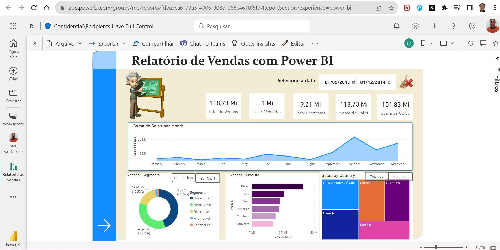
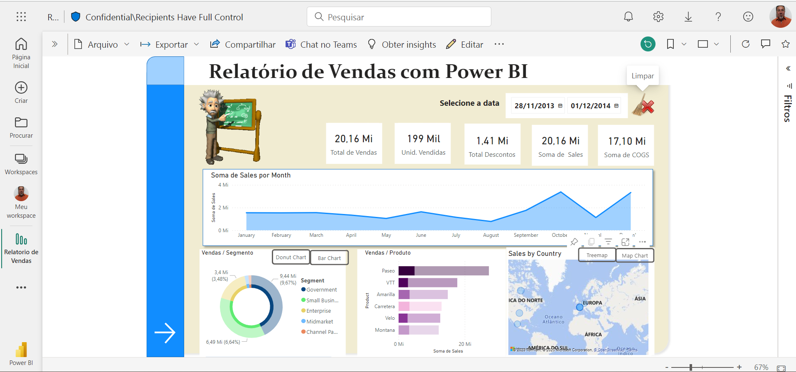
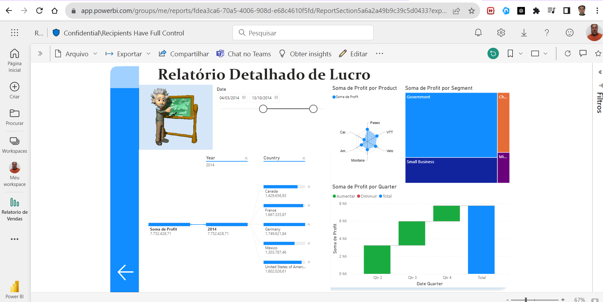

<H1>Relatório de Vendas com Power BI</H1>

Power BI - 2024

  

## Relatório interativo com Power BI

Este repositório contém um projeto de relatório de vendas desenvolvido com Power BI. O relatório oferece uma visão abrangente e interativa dos dados de vendas, permitindo uma análise detalhada das métricas de desempenho de vendas

## Recursos

- Visualizações dinâmicas e informativas que mostram o desempenho de vendas por produtos, regiões e períodos.
- Gráficos intuitivos que ilustram tendências, variações e padrões de vendas.
- Medidas calculadas personalizadas para análises mais profundas, incluindo alterações em relação a períodos anteriores.
- Painéis interativos que permitem explorar os dados e extrair insights específicos.
- Integração com dados em tempo real, fornecendo informações atualizadas e precisas.
- Interface amigável para navegar e filtrar dados facilmente.

## Tecnologia

- Power BI Desktop

## Services used

- Power BI serviço

## How to use

1. Obtenha o arquivo do relatório: localize e baixe o arquivo do relatório .pbix. Este formato de arquivo armazena a definição do relatório do Power BI.
2. Abrir no Power BI Desktop: inicie o aplicativo Power BI Desktop em seu computador e abra o .pbixarquivo baixado.
3. Conecte seus dados (opcional): se o relatório usar dados de amostra, você poderá conectá-los à sua própria fonte de dados de vendas reais para obter uma visualização mais personalizada.
4. Explorar e analisar: o Power BI Desktop permite que você interaja com visualizações pré-construídas, como gráficos e painéis. Isso permite explorar o desempenho de vendas de vários ângulos.
5. Personalize o relatório: personalize o relatório! Você pode modificar os recursos visuais existentes, adicionar novos e ajustar filtros para focar em áreas específicas de seus dados de vendas.
6. Compartilhe insights: quando estiver satisfeito com o relatório, você poderá compartilhá-lo com colegas ou partes interessadas. Isso facilita a colaboração e a tomada de decisões baseada em dados.

## Resultados

## Conclusão

Definitivamente, este relatório de vendas do Power BI é uma ferramenta valiosa para analisar o desempenho de vendas e tomar decisões baseadas em dados. Sinta-se à vontade para explorar, adaptar e compartilhar este relatório para aprimorar sua compreensão e otimizar as operações de vendas.

## Autor

- **Marcelino Issa da Cunha**:

- (<https://github.com/Issa1896?tab=repositories>)

  

  

  

